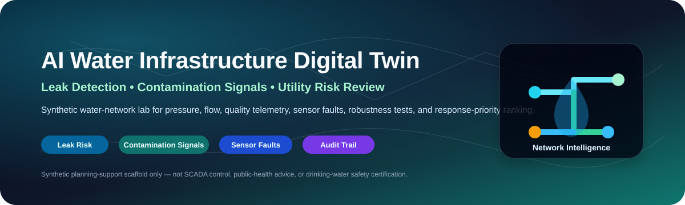
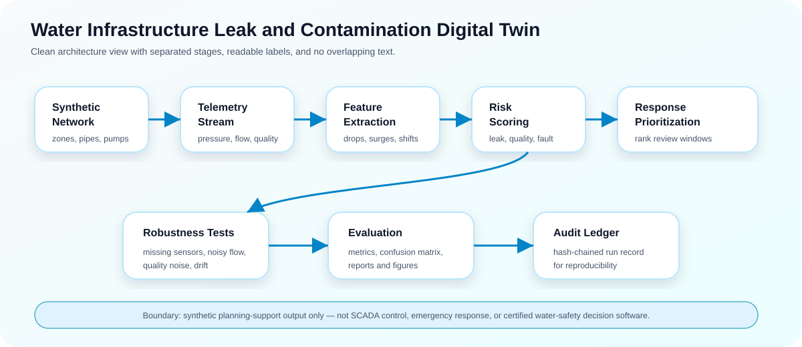
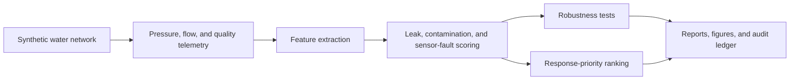
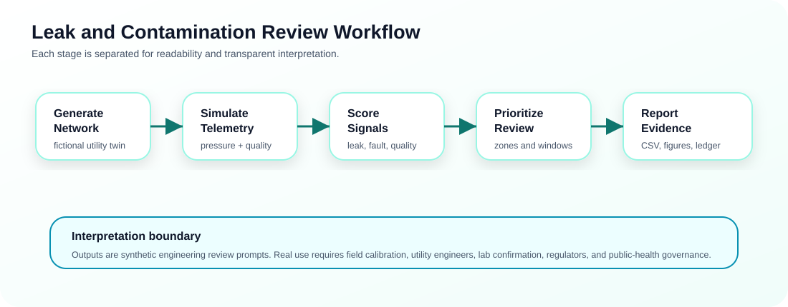

<p align="center">
  
</p>

<h1 align="center">AI Water Infrastructure Leak and Contamination Digital Twin</h1>

<p align="center">
  <b>A research-grade synthetic water-infrastructure digital twin for leak-like pressure events, contamination-like quality shifts, sensor-fault separation, robustness testing, and response-priority review.</b>
</p>

<p align="center">
  <a href="../../actions/workflows/python-checks.yml"></a>
  
  
  
  
</p>

---

## Overview

**AI Water Infrastructure Leak and Contamination Digital Twin** is an independent academic research prototype for studying how AI-assisted monitoring can support water-utility engineering review. It uses fictional synthetic zones, pipes, tanks, pumps, sensors, and telemetry to evaluate leak-like pressure/flow anomalies, contamination-like water-quality shifts, sensor-fault behavior, and response-priority ranking.

The project is designed around one careful research question: **can a synthetic digital twin help detect and triage water-infrastructure risk signals while keeping results auditable, reproducible, and clearly separated from real public-health decisions?**

It is useful for research and teaching in:

- Smart water infrastructure and cyber-physical systems.
- Leak-like pressure-drop and flow-surge detection.
- Contamination-like water-quality anomaly review.
- Sensor-fault separation and calibration-risk analysis.
- Missing/noisy sensor robustness testing.
- Response-priority scoring for engineering review.
- Responsible AI, auditability, and reproducible infrastructure simulation.

> **Water-safety boundary:** this repository uses synthetic data only. It is not public-health advice, drinking-water safety certification, emergency-response software, SCADA/utility-control software, or a replacement for water utility engineers, certified laboratories, regulators, or public-health authorities.

---

## Research objective

Can an AI water-infrastructure digital twin detect leak-like, contamination-like, and sensor-fault-like signals while prioritizing engineering review across a synthetic utility network?

| Research question | Evidence generated locally |
|---|---|
| Where are leak-like pressure and flow anomalies? | Leak-risk scores and zone/pipe anomaly tables |
| Where are contamination-like quality shifts? | Turbidity, chlorine, pH, and conductivity shift scores |
| Which alerts may actually be sensor faults? | Sensor-fault separation and calibration-risk features |
| How robust is detection under weak telemetry? | Missing/noisy sensor stress tests |
| Which zones need review first? | Response-priority ranking and review windows |
| Can runs be reproduced? | CSV outputs, JSON summary, figures, reports, and hash-chained audit ledger |

---

## Architecture

<p align="center">
  
</p>



<p align="center">
  
</p>

The workflow is intentionally transparent. Each output is a synthetic engineering review prompt, not an automated utility action.

---

## Core capabilities

| Capability | What it does | Why it matters |
|---|---|---|
| Synthetic utility twin | Builds fictional zones, pipes, pumps, tanks, sensors, and telemetry | Enables safe experimentation without real utility data |
| Leak-like anomaly scoring | Reviews pressure drops, flow surges, and zone-level patterns | Helps study early leak-detection workflows |
| Contamination-like signal review | Flags quality shifts in turbidity, chlorine, pH, and conductivity | Supports transparent contamination-pattern simulation |
| Sensor-fault separation | Tracks missing data, noisy readings, drift, and calibration risk | Reduces confusion between infrastructure events and bad telemetry |
| Robustness testing | Stress-tests detection under missing/noisy sensors | Shows how fragile a detection method may be |
| Response-priority ranking | Ranks review windows by risk, critical customers, equity, and infrastructure age | Supports planning-style triage without automating action |
| Audit ledger | Writes hash-chained run records | Supports reproducibility and research accountability |

---

## Run today — no real utility data needed

```bash
python scripts/run_synthetic_water_lab.py
```

Windows quick start:

```bat
cd %USERPROFILE%\ai-water-infrastructure-leak-contamination-twin
git pull

py -m venv .venv
.venv\Scripts\activate

python -m pip install --upgrade pip
python -m pip install -r requirements.txt
python scripts\run_synthetic_water_lab.py
```

Optional larger run:

```bash
python scripts/run_synthetic_water_lab.py --zones 30 --sensors 120 --hours 96 --seed 42
```

Run tests:

```bash
python -m pytest -q
```

---

## Generated local outputs

```text
outputs/results/synthetic_water_zones.csv
outputs/results/synthetic_pipe_network.csv
outputs/results/synthetic_tanks.csv
outputs/results/synthetic_pumps.csv
outputs/results/synthetic_sensors.csv
outputs/results/synthetic_sensor_readings.csv
outputs/results/synthetic_water_features.csv
outputs/results/synthetic_anomaly_scores.csv
outputs/results/synthetic_robustness_tests.csv
outputs/results/synthetic_response_priorities.csv
outputs/results/synthetic_detection_metrics.csv
outputs/results/synthetic_confusion_matrix.csv
outputs/results/synthetic_water_twin_summary.json
outputs/reports/synthetic_water_infrastructure_report.md
outputs/audit/water_infrastructure_audit_log.jsonl

outputs/figures/synthetic_anomaly_score_distribution.png
outputs/figures/synthetic_zone_response_priority.png
outputs/figures/synthetic_water_quality_shift.png
outputs/figures/synthetic_sensor_robustness.png
outputs/figures/synthetic_detection_metrics.png
outputs/figures/synthetic_priority_bands.png
```

---

## Signal groups

| Signal group | Example indicators | Interpretation boundary |
|---|---|---|
| Leak-like behavior | Pressure drop, flow surge, zone imbalance | Engineering review prompt only |
| Contamination-like behavior | Turbidity shift, chlorine drop, pH excursion, conductivity change | Not a lab-confirmed contamination claim |
| Sensor-fault-like behavior | Missing values, noisy readings, drift, calibration risk | Needs instrument review before interpretation |
| Priority context | Critical customers, infrastructure age, equity proxy, event severity | Planning-style ranking only |

---

## Robustness and safety checks

The lab includes stress tests for weak telemetry conditions:

| Stress test | Purpose |
|---|---|
| Missing pressure | Reviews detection stability when pressure sensors drop out |
| Noisy flow | Tests sensitivity to unstable flow readings |
| Quality noise | Checks whether contamination-like scoring is too fragile |
| Sensor dropout | Measures behavior under partial telemetry loss |
| Calibration drift | Separates gradual sensor error from real event signals |

---

## Responsible water-infrastructure boundary

This project supports synthetic planning, research prototyping, education, and reproducible analysis. Real water-system decisions require calibrated field instruments, certified lab sampling, validated hydraulic models, utility engineers, public-health authorities, incident command procedures, chain-of-custody, and formal governance.

The system should never be used as the sole basis for drinking-water safety decisions, boil-water advisories, emergency response, public-health communication, utility operations, regulatory reporting, or real-world contamination claims.

---

## Repository map

```text
src/watertwin/
  synthetic.py       # fictional water network, sensors, and telemetry
  features.py        # leak, quality, and sensor-fault feature extraction
  detection.py       # anomaly scoring and classification
  robustness.py      # missing/noisy sensor stress tests
  priority.py        # response-priority ranking
  evaluation.py      # metrics and confusion matrix
  audit.py           # hash-chained audit ledger
  visualization.py   # local figures
  reporting.py       # Markdown water-infrastructure report
scripts/
  run_synthetic_water_lab.py
assets/
  banner.svg
  water_twin_architecture.svg
  water-infrastructure-workflow.svg
docs/
  governance-and-ethics.md
  reproducibility-playbook.md
  publication-readiness-plan.md
```

---

## Documentation

- [`docs/governance-and-ethics.md`](docs/governance-and-ethics.md): water-safety, data-governance, and AI-control boundaries.
- [`docs/reproducibility-playbook.md`](docs/reproducibility-playbook.md): run records, output bundles, and interpretation rules.
- [`docs/publication-readiness-plan.md`](docs/publication-readiness-plan.md): possible academic framing and paper structure.

---

## Future extensions

| Extension | Requirement before claiming results |
|---|---|
| Real telemetry validation | Utility permission, data governance, and calibrated sensors |
| Hydraulic model integration | Model assumptions, calibration, and engineer review |
| Lab-confirmed quality data | Chain of custody and certified testing procedure |
| Real-time deployment | Cybersecurity review, fail-safe controls, and human-in-the-loop design |
| Equity-aware service review | Community context and service-impact assessment |
| Cross-utility benchmarking | Comparable schemas, uncertainty reporting, and governance approval |

---

## Limitations

- Synthetic data validates pipeline behavior, not real-world leak or contamination detection performance.
- Scores are review prompts, not drinking-water safety determinations.
- Sensor-fault separation is a transparent baseline, not a certified diagnostic model.
- Response-priority ranking is not emergency dispatch guidance.
- Real deployments require certified measurements, field validation, expert review, regulatory governance, and uncertainty communication.

## License

Released under the [MIT License](LICENSE). Synthetic examples are provided for research and education only.
