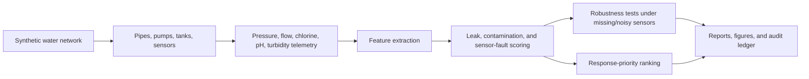

# AI Water Infrastructure Leak and Contamination Digital Twin

<p align="center"><strong>Independent research-grade synthetic water-infrastructure digital twin for detecting leaks, contamination anomalies, sensor faults, pressure drops, flow surges, and response priorities across a fictional water utility network.</strong></p>

<p align="center">
  <a href="../../actions/workflows/python-checks.yml"></a>
  <a href="LICENSE"></a>
  
  
</p>

> **Water-safety boundary:** this repository uses fictional synthetic zones, pipes, pumps, tanks, sensors, and telemetry by default. It is independent research and planning-support infrastructure only. It is not public-health advice, drinking-water safety certification, emergency-response software, SCADA/utility-control software, or a replacement for water utility engineers, certified laboratories, regulators, or public-health authorities.

---

## Research objective

Can an AI water-infrastructure digital twin detect leaks, contamination anomalies, and sensor faults while prioritizing response actions across a synthetic utility network?

| Research question | Evidence generated locally |
| --- | --- |
| Where are leak-like pressure and flow anomalies? | Leak-risk scores and pipe/zone anomaly tables |
| Where are contamination-like water-quality anomalies? | Turbidity, chlorine, pH, and conductivity shift scores |
| Which alerts may be sensor faults? | Sensor-fault separation and calibration-risk scores |
| How robust is detection under bad telemetry? | Missing/noisy sensor stress tests |
| Which zones need engineering review first? | Response-priority ranking and review windows |
| Can runs be reproduced? | JSON summary and hash-chained audit ledger |

---

## Architecture

<p align="center"></p>



---

## Run today — no real utility data needed

```bash
python scripts/run_synthetic_water_lab.py
```

Windows quick start:

```bat
cd %USERPROFILE%\ai-water-infrastructure-leak-contamination-twin
git pull

py -m venv .venv
.venv\Scripts\activate

python -m pip install --upgrade pip
python -m pip install -r requirements.txt
python scripts/run_synthetic_water_lab.py
```

Optional larger run:

```bash
python scripts/run_synthetic_water_lab.py --zones 30 --sensors 120 --hours 96 --seed 42
```

Run tests:

```bash
python -m pytest -q
```

---

## Generated local outputs

```text
outputs/results/synthetic_water_zones.csv
outputs/results/synthetic_pipe_network.csv
outputs/results/synthetic_tanks.csv
outputs/results/synthetic_pumps.csv
outputs/results/synthetic_sensors.csv
outputs/results/synthetic_sensor_readings.csv
outputs/results/synthetic_water_features.csv
outputs/results/synthetic_anomaly_scores.csv
outputs/results/synthetic_robustness_tests.csv
outputs/results/synthetic_response_priorities.csv
outputs/results/synthetic_detection_metrics.csv
outputs/results/synthetic_confusion_matrix.csv
outputs/results/synthetic_water_twin_summary.json
outputs/reports/synthetic_water_infrastructure_report.md
outputs/audit/water_infrastructure_audit_log.jsonl

outputs/figures/synthetic_anomaly_score_distribution.png
outputs/figures/synthetic_zone_response_priority.png
outputs/figures/synthetic_water_quality_shift.png
outputs/figures/synthetic_sensor_robustness.png
outputs/figures/synthetic_detection_metrics.png
outputs/figures/synthetic_priority_bands.png
```

---

## Digital twin modules

| Module | Purpose |
| --- | --- |
| Synthetic generator | Builds fictional zones, pipes, tanks, pumps, sensors, and telemetry |
| Feature engineering | Creates pressure-drop, flow-surge, water-quality-shift, missing-data, and sensor-fault features |
| Detection scoring | Separates leak-like, contamination-like, and sensor-fault-like risk signals |
| Robustness testing | Tests score degradation under missing pressure, noisy flow, quality noise, dropout, and calibration drift |
| Priority planning | Ranks affected zones by risk, critical customers, equity, and infrastructure age |
| Evaluation | Computes synthetic accuracy, precision, recall, F1, and confusion matrix |
| Reporting | Produces Markdown reports, CSVs, JSON summaries, figures, and audit logs |

---

## Independent water-infrastructure boundary

This project supports synthetic planning, research prototyping, education, and reproducible analysis. Real water-system decisions require calibrated field instruments, certified lab sampling, validated hydraulic models, utility engineers, public-health authorities, incident command procedures, chain-of-custody, and formal governance.

The system should never be used as the sole basis for drinking-water safety decisions, boil-water advisories, emergency response, public-health communication, utility operations, regulatory reporting, or real-world contamination claims.

---

## Repository map

```text
src/watertwin/
  synthetic.py       # fictional water network, sensors, and telemetry
  features.py        # leak, quality, and sensor-fault feature extraction
  detection.py       # anomaly scoring and classification
  robustness.py      # missing/noisy sensor stress tests
  priority.py        # response-priority ranking
  evaluation.py      # metrics and confusion matrix
  audit.py           # hash-chained audit ledger
  visualization.py   # local figures
  reporting.py       # Markdown water-infrastructure report
scripts/
  run_synthetic_water_lab.py
docs/
  methodology.md
  water_safety_boundary.md
  synthetic_lab.md
  report_template.md
tests/
  test_synthetic.py
  test_water_modules.py
  test_pipeline.py
  test_audit.py
```

---

## Limitations

- Synthetic data validates the pipeline but does not prove real-world leak or contamination detection performance.
- Scores are review prompts, not drinking-water safety determinations.
- Sensor-fault separation is a transparent baseline, not a certified diagnostic model.
- Real deployments require certified measurements, field validation, expert review, regulatory governance, and uncertainty communication.
